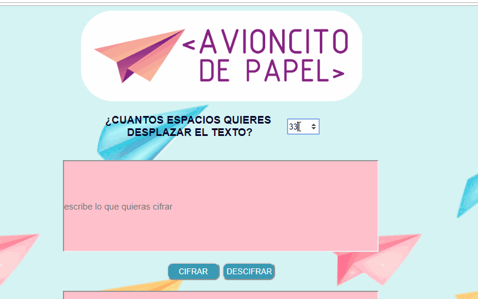

#Avioncito de Papel
## Usuarias, usuarios y objetivo
Es una página educativa para niñes de entre **8 y 15** años que busca enseñar la base de la encriptación a través de las primeras formas de cifrado que datan en la historia. 
El objetivo de esta página no es lograr un cifrado complejo, si no que entregar un **método** que genere el entendimiento a los encriptados existentes en la modernidad. 
Se toma esta decisión ya que les niñes tienen un acceso desde muy temprana edad a situaciones donde deben ingresar contraseñas o entregar datos a la net, y **comprender su seguridad** es primordial en el buen uso de redes sociales, juegos y páginas.
Para llegar a este objetivo realice un prototipo que fue mostrado a niñes y adultes donde se generó principalmente la idea de que fuera un espacio de fácil entendimiento y de simpleza visual.

##Diseño y uso
Por esto tenemos una primera página donde se explica en palabras simples que es el cifrado cesar y se da la opción de comenzar  a cifrar y descifrar. al apretar este botón llegamos a una segunda página donde podemos poner la opción de offset o espacios que queremos mover las letra o números escritos y dos cajas de texto una donde escribimos y otra donde recibimos la respuesta. Esto mediante dos botones de cifrado y descifrado y un tercer botón de reset que limpia los datos agregados.
Se uso una paleta de colores pasteles, y se eligió la imagen de un avión de papel como símbolo del envio de mensajes secretos

